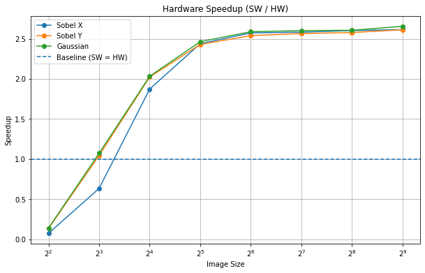
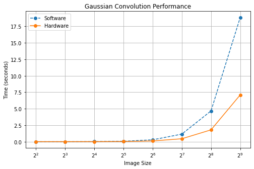

# FPGA Streaming 2D Convolution Accelerator

This project explores the hardware acceleration of **2D image convolution** using **Xilinx Vitis HLS**, **Vivado**, and a **PYNQ-based Python runtime**. The goal is to study how different hardware architectures affect latency, throughput, and resource utilization, then compare the final streaming accelerator against a software baseline across multiple image sizes and kernels.

For this update, I implemented and evaluated a **DMA-connected streaming convolution accelerator** with AXI-Stream input/output, AXI-Lite control, and a Python benchmarking pipeline. I also performed HLS design space exploration across several convolution architectures.

---

## Project Overview

The project currently includes six convolution implementations:

- **conv_baseline** – naive nested-loop convolution.
- **conv_pipeline** – pipelined version of the baseline.
- **conv_linebuffer** – line-buffer-based convolution for improved data reuse.
- **conv_dataflow** – sliding-window + dataflow architecture.
- **conv_dataflow_stream** – AXI-streamed hardware accelerator with 32-bit packed pixel transfers and `uint8_t` output formatting.
- **conv_dataflow_stream_int** – streamed verification version with `int` output for debugging and validation.

The streamed design is integrated into a Vivado block design with:
- **Zynq Processing System**
- **AXI DMA**
- **custom HLS convolution IP**

The software side uses a Jupyter notebook to:
- Configure the hardware accelerator.
- Send image data over DMA.
- Receive and unpack output.
- Compare against a software reference.
- Benchmark software vs hardware performance.

---

## Hardware Aspect of This Update

This update includes the required hardware component by taking a software image-processing operation, **2D convolution**, and performing **HLS design space exploration** on multiple hardware architectures.

### Hardware work completed
- Implemented multiple HLS convolution architectures
- Generalized designs to support configurable kernel sizes in HLS.
- Built a streaming convolution IP with:
  - **AXI-Stream** input/output
  - **AXI-Lite** control interface
  - **32-bit packed input/output words**
- Integrated the HLS IP into a Vivado design with **AXI DMA**
- Generated a `.bit` and `.hwh` for runtime execution from Python using PYNQ.

---

## Repository Structure

```text
.
├── README.md
├── notebooks
│   └── stream_convolution_analysis.ipynb
├── results
│   ├── convolution_benchmark_results.csv
│   ├── gaussian_convolution_performance.png
│   ├── hardware_speedup.png
│   ├── hls_synthesis_results.csv
│   ├── sobel_x_convolution_performance.png
│   └── sobel_y_convolution_performance.png
├── source
│   ├── conv_baseline.cpp
│   ├── conv_dataflow.cpp
│   ├── conv_dataflow_stream.cpp
│   ├── conv_kernels.h
│   ├── conv_linebuffer.cpp
│   └── conv_pipeline.cpp
├── testbench
│   └── conv_kernels_tb.cpp
└── vivado
    ├── fpga_2d_convolution.bit
    ├── fpga_2d_convolution.hwh
    ├── fpga_2d_convolution.pdf
    └── fpga_2d_convolution.tcl
```
---

## Inputs
The current benchmarking pipeline uses randomly generated grayscale images created with NumPy at the following input sizes:

- **4×4**
- **8×8**
- **16×16**
- **32×32**
- **64×64**
- **128×128**
- **256×256**
- **512×512**

The following 3×3 kernels are used:

**Sobel X**
```python
[-1,  0,  1]
[-2,  0,  2]
[-1,  0,  1]
```

**Sobel Y**
```python
[-1, -2, -1]
[ 0,  0,  0]
[ 1,  2,  1]
```

**Gaussian Blur**
```python
[1, 2, 1]
[2, 4, 2]
[1, 2, 1]
```

---

## Verification Summary
Correctness was verified in two stages.

### 1. HLS testbecnh verification
The C++ testbench:

1. Generates random input images.
2. Computes a golden reference convolution.
3. Runs each HLS design.
4. Compares outputs element-by-element.

This verified correctness for:
- Baseline
- Pipeline
- Linebuffer
- Dataflow
- Streamed `int` design
- Streamed `uint8_t` design

### 2. End-to-end Python vs hardware verification
The Jupyter notebook:

1. Computes a software reference result in Python.
2. Runs the hardware accelerator through DMA.
3. Unpacks hardware output.
4. Checks exact equality using `np.array_equal(...)`.

The Python reference matches the hardware behavior by applying:

- Normalization shift
- Clamping to [0, 255]

This ensures the software and hardware are being compared fairly.

---

## HLS Design Space Exploration Results
The following table summarizes the HLS synthesis results for the 512×512 case.

| Design                     | Data Type | II | Latency (Cycles) | Latency (ns) | Interval | BRAM | DSP | FF   | LUT  | URAM |
|---------------------------|----------|----|------------------|--------------|----------|------|-----|------|------|------|
| conv_baseline             | int      | 9  | 2340922          | 2.34E+07     | 2340923  | 4    | 9   | 3561 | 5327 | 0    |
| conv_pipeline             | int      | 9  | 2340921          | 2.34E+07     | 2340922  | 4    | 10  | 3848 | 5119 | 0    |
| conv_linebuffer           | int      | 3  | 786452           | 7.87E+06     | 786453   | 6    | 20  | 4031 | 5205 | 0    |
| conv_dataflow             | int      | 1  | 262164           | 2.62E+06     | 262165   | 6    | 30  | 3288 | 4119 | 0    |
| conv_dataflow_stream      | uint8_t  | 1  | 265731           | 2.66E+06     | 265732   | 2    | 21  | 1459 | 2972 | 0    |
| conv_dataflow_stream_int  | int      | 1  | 265730           | 2.66E+06     | 265731   | 2    | 18  | 1361 | 2537 | 0    |

### Synthesis Takeaways
- The **dataflow-style architectures** achieved the best initiation interval, reaching **II = 1**.
- The **linebuffer** design significantly reduced latency compared to the **baseline** and **pipelined** versions.
- The final **streaming architecture** maintained near-dataflow latency while integrating AXI streaming and DMA compatibility.
- Resource usage varies across designs due to architectural differences, stream interfaces, and data representation.

---

## Software vs Hardware Benchmarking
The notebook benchmarks:

- Software convolution time
- Total hardware time
- Hardware execution time
- Packing time
- Unpacking time
- Speedup
- Overhead ratio

### Representative Results (Selected Sizes)

| Kernel   | Size | SW Time (s) | HW Time (s) | Speedup |
|----------|------|------------|------------|--------|
| Sobel X  | 16   | 0.0142     | 0.0076     | 1.87×  |
| Sobel X  | 512  | 18.64      | 7.13       | 2.61×  |
| Sobel Y  | 16   | 0.0141     | 0.0070     | 2.02×  |
| Sobel Y  | 512  | 18.64      | 7.13       | 2.61×  |
| Gaussian | 16   | 0.0142     | 0.0070     | 2.03×  |
| Gaussian | 512  | 18.87      | 7.10       | 2.65×  |

The complete benchmark results are stored in:
```text
results/convolution_benchmark_results.csv
```

### Key Findings
- Hardware begins outperforming software at small-to-moderate input sizes.
- For **Sobel Y** and **Gaussian**, hardware already becomes faster at **8×8**.
- For **Sobel X**, hardware becomes faster at **16×16**.
- From **16×16** onward, hardware consistently outperforms software across all kernels.



*Figure: Hardware speedup (SW/HW) vs input size. The crossover point occurs between 8×8 and 16×16, after which hardware consistently outperforms software.*

### Representative Benchmark Observations
- Speedup at larger sizes is consistently around **2.4×** to **2.65×**.
- At **512×512**, speedup is:
  - **Sobel X**: ~2.61×
  - **Sobel Y**: ~2.61×
  - **Gaussian**: ~2.66×
  


*Figure: Software vs hardware execution time for Gaussian convolution. Hardware achieves increasing advantage as input size grows due to its pipelined streaming architecture.*

### Overhead Analysis
Average overhead ratio by kernel:

| Kernel | Average Overhead Ratio |
|--------|------------------------|
| Gaussian | 0.90051 |
| Sobel X | 0.90686 |
| Sobel Y | 0.90066 |

This shows that a large fraction of end-to-end hardware time is still spent in:

- Input packing
- Output unpacking
- DMA-related software-side data handling

The **actual hardware compute time** is very low, especially at larger sizes. At high resolutions, the dominant bottleneck becomes **output unpacking in Python**, not the convolution engine itself.

Overall, these results demonstrate that while the FPGA accelerator provides high computational throughput, system-level performance is ultimately constrained by data movement and formatting overhead between hardware and software.

---

## Key Insight

The most important result from this update is that:

>**The hardware compute pipeline is efficient, but end-to-end performance is heavily influenced by software-side data handling overhead.**


The streamed accelerator achieves high throughput because of its **pipelined II = 1 architecture**, but overall speedup is partially limited by:

- Packing pixels into 32-bit stream words
- Unpacking hardware output back into `uint8_t`
- DMA transfer overhead

This reflects an important system-design lesson:

>**Accelerator performance depends not only on computation, but also on the cost of moving and formatting data between hardware and software.**

---

## How To Run

### Option 1: HLS Design Space Exploration
1. Open **Vitis HLS**
2. Create a new project
3. In **Hardware** tab, In search look for `xczu3eg-sfvc784-2-e` and select it.
4. Add the following source files:
    ```text
    source/
      conv_baseline.cpp
      conv_pipeline.cpp
      conv_linebuffer.cpp
      conv_dataflow.cpp
      conv_dataflow_stream.cpp
      conv_kernels.h
    ```
5. Add the testbench:
    ```text
    testbench/
      conv_kernels_tb.cpp
    ```
6. Select the **top** function you want to synthesize:
    - `conv_baseline`
    - `conv_pipeline`
    - `conv_linebuffer`
    - `conv_dataflow`
    - `conv_dataflow_stream`
    - `conv_dataflow_stream_int`
7. Run:
    - **C Simulation** for correctness
    - **C Synthesis** for performance/resource results

### Option 2: Run the Streamed Hardware Design from Python
The provided bitstream was generated for the **Zynq UltraScale+ AUP-ZU3 4GB Development Board**.

Requirements:
- PYNQ-enabled environment
- bitstream and `.hwh` file in the `vivado/` directory
1. Open and run:

    ```text
    notebooks/stream_convolution_analysis.ipynb
    ```
>  **Important Constraint**  
> The provided bitstream is configured for a **3×3 convolution kernel**.  
> While the HLS code supports dynamic kernel sizes, changing the kernel size requires:
> 1. Modifying the kernel size in the C++ source
> 2. Re-running HLS C-synthesis
> 3. Regenerating the Vivado design and bitstream  
> The current overlay will only work correctly with 3×3 kernels.

The notebook:
- Loads the overlay
- Configures the HLS IP through AXI-Lite
- Sends image data using DMA
- Receives hardware output
- Unpacks the 32-bit stream data
- Compares output against software
- Benchmarks across multiple image sizes and kernels

---

## Output
The project currently provides:

- HLS synthesis data in CSV form
- Software vs hardware benchmark data in CSV form
- Jupyter notebook plots and tables
- Vivado schematic PDF
- Bitstream and `.hwh` for hardware execution

Output files include:
```text
results/hls_synthesis_results.csv
results/convolution_benchmark_results.csv
results/sobel_x_convolution_performance.png
results/sobel_y_convolution_performance.png
results/gaussian_convolution_performance.png
results/hardware_speedup.png
vivado/fpga_2d_convolution.bit
vivado/fpga_2d_convolution.hwh
vivado/fpga_2d_convolution.tcl
vivado/fpga_2d_convolution.pdf
```

---

## Plan for the Remainder of the Semester

The next steps for the project are:
- Reduce software-side unpacking overhead.
- Optimize packing/unpacking with vectorized or hardware-aware approaches.
- Add support for **RGB images**.
- Implement **tiling** for larger images.
- Continue HLS design space exploration where useful.
- Improve the runtime pipeline and analysis notebook.
- Evaluate how much additional speedup can be unlocked by reducing data marshaling overhead.

---

## Summary
This update adds a complete hardware/software path for a streaming 2D convolution accelerator:

- HLS architecture exploration
- Vivado DMA integration
- Python runtime execution
- Correctness verification
- Benchmark analysis

The design is functionally correct, hardware-accelerated, and already demonstrates meaningful speedup over software at moderate and large image sizes.