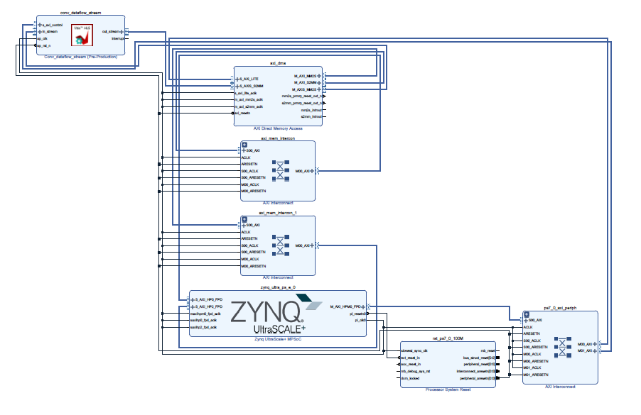
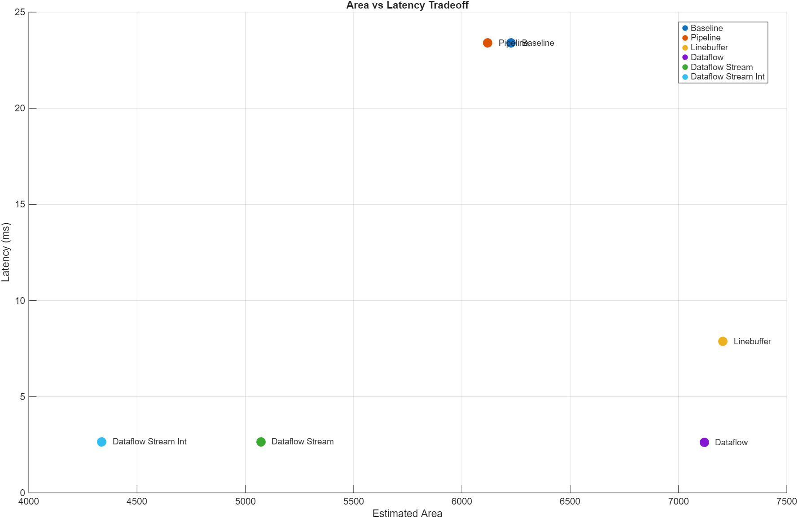
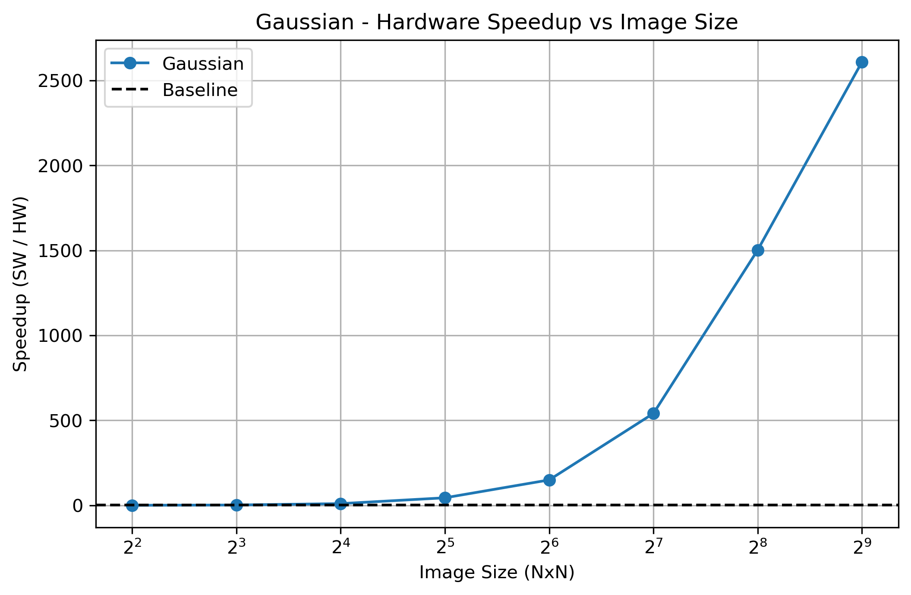
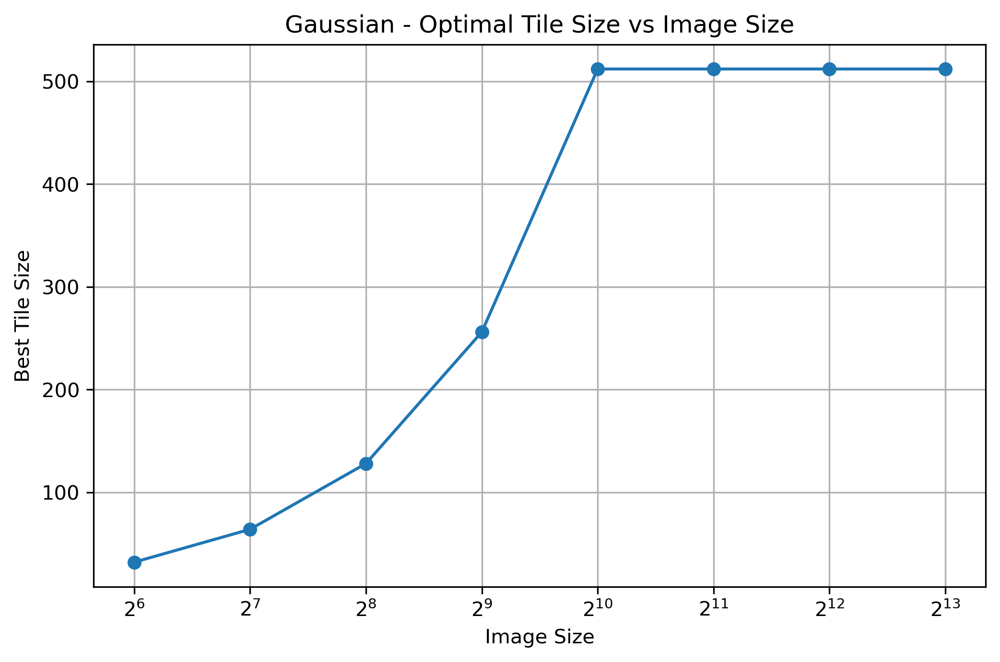
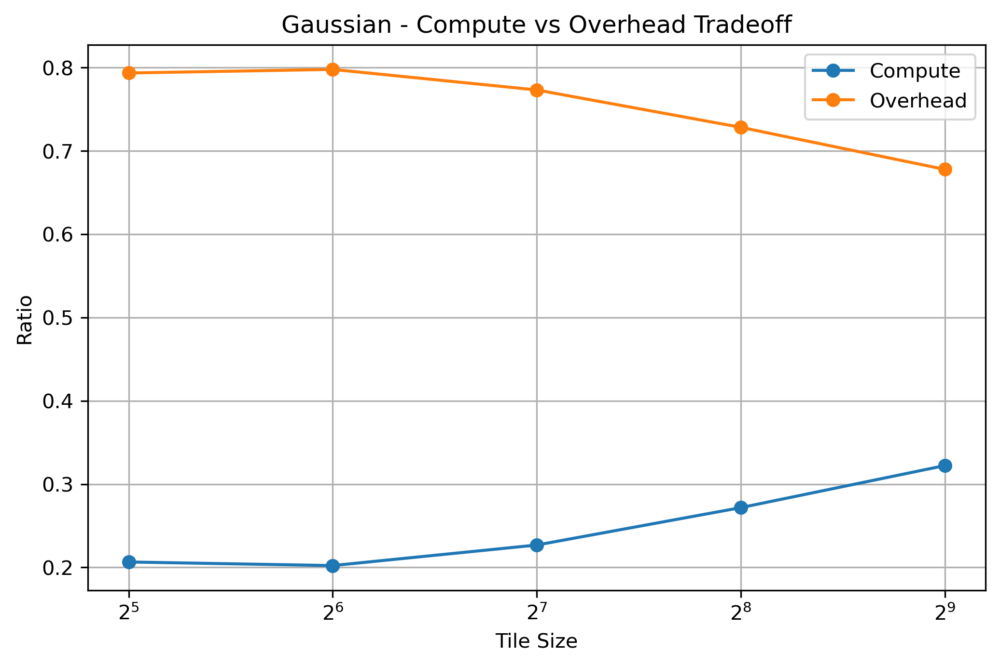

# FPGA Streaming 2D Convolution Accelerator

This project explores the hardware acceleration of **2D image convolution** using **Xilinx Vitis HLS**, **Vivado**, and a **PYNQ-based Python runtime**. The goal is to study how different hardware architectures affect latency, throughput, and resource utilization, then compare the final streaming accelerator against a software baseline across multiple image sizes and kernels.

The final system is a **DMA-connected streaming convolution accelerator** with **AXI-Stream** input/output, **AXI-Lite** control, and a Python benchmarking pipeline. In addition to HLS design-space exploration, the project now includes **tiled execution for large images** and a lightweight **RGB extension** built by reusing the grayscale pipeline across channels.

---

## Project Overview

The project includes six convolution implementations:

- **conv_baseline** – naive nested-loop convolution
- **conv_pipeline** – pipelined version of the baseline
- **conv_linebuffer** – line-buffer-based convolution for improved data reuse
- **conv_dataflow** – sliding-window + dataflow architecture
- **conv_dataflow_stream** – AXI-streamed hardware accelerator with 32-bit packed pixel transfers and `uint8_t` output formatting
- **conv_dataflow_stream_int** – streamed verification version with `int` output for debugging and validation

The final streamed design is integrated into a Vivado block design with:
- **Zynq UltraScale+ Processing System**
- **AXI DMA**
- **custom HLS convolution IP**

The software side uses a Jupyter notebook to:
- configure the hardware accelerator
- send image data over DMA
- receive and unpack output
- compare against a software reference
- benchmark software vs hardware performance
- evaluate tiled execution for oversized images
- benchmark RGB execution through three grayscale passes

---

## Hardware Aspect of the Project

This project takes a software image-processing operation, **2D convolution**, and implements it as a hardware accelerator using **HLS design-space exploration**.



*Vivado block design showing the Zynq processing system, AXI DMA, and streamed convolution IP.*

### Hardware work completed

- Implemented multiple HLS convolution architectures
- Used compile-time constants for maximum image size and kernel size to improve HLS optimization
- Built a streaming convolution IP with:
  - **AXI-Stream** input/output
  - **AXI-Lite** control interface
  - **32-bit packed input/output words**
- Integrated the HLS IP into a Vivado design with **AXI DMA**
- Generated a `.bit` and `.hwh` for runtime execution from Python using PYNQ

### Design constraints

The deployed accelerator was synthesized with:
- **maximum input size:** `512 × 512`
- **kernel size:** `3 × 3`

Although the code structure can be adapted for other kernel sizes, changing the kernel size requires updating the compile-time constants in the HLS header and regenerating the synthesized design and bitstream.

---

## Repository Structure

```text
.
├── README.md
├── notebooks
│   └── stream_convolution_analysis.ipynb
├── results
│   ├── plots
│   │   ├── grayscale
│   │   ├── hls
│   │   └── tiling
│   └── tables
│       ├── grayscale
│       ├── hls
│       ├── rgb
│       └── tiling
├── source
│   ├── conv_baseline.cpp
│   ├── conv_pipeline.cpp
│   ├── conv_linebuffer.cpp
│   ├── conv_dataflow.cpp
│   ├── conv_dataflow_stream.cpp
│   └── conv_kernels.h
├── testbench
│   └── conv_kernels_tb.cpp
└── vivado
    ├── fpga_2d_convolution.bit
    ├── fpga_2d_convolution.hwh
    ├── fpga_2d_convolution.pdf
    ├── fpga_2d_convolution.png
    └── fpga_2d_convolution.tcl

```

---

## Inputs

The benchmarking pipeline uses randomly generated grayscale images created with NumPy.

### Grayscale benchmarking sizes

Square image sizes are evaluated in powers of two from:

- **4×4**
- **8×8**
- **16×16**
- **32×32**
- **64×64**
- **128×128**
- **256×256**
- **512×512**
- **1024×1024**
- **2048×2048**
- **4096×4096**
- **8192×8192**

Software execution and untiled hardware execution are performed only up to 512×512, which matches the deployed hardware’s maximum single-pass input size. Larger images are evaluated using tiled execution.

### Kernels

The following 3×3 kernels are used:

**Sobel X**
```python
[-1,  0,  1]
[-2,  0,  2]
[-1,  0,  1]
```

**Sobel Y**
```python
[-1, -2, -1]
[ 0,  0,  0]
[ 1,  2,  1]
```

**Gaussian Blur**
```python
[1, 2, 1]
[2, 4, 2]
[1, 2, 1]
```

### Normalization Shift

The runtime uses an integer normalization parameter, `norm_shift`, which right-shifts the convolution sum by a fixed number of bits after accumulation. This provides efficient integer-only normalization in both software and hardware.

- **Sobel X**: `norm_shift = 0`
- **Sobel Y**: `norm_shift = 0`
- **Gaussian Blur**: `norm_shift = 4`

---

## Verification Summary

Correctness was verified at multiple levels.

### 1. HLS Testbench Verification

The C++ testbench:

1. Generates random input images.
2. Computes a golden reference convolution.
3. Runs each HLS design.
4. Compares outputs element-by-element.

This verified correctness for:

- Baseline
- Pipeline
- Linebuffer
- Dataflow
- Streamed `int` design
- Streamed `uint8_t` design

### 2. End-to-end Python vs Hardware Verification

The Jupyter notebook:

1. Computes a software reference result in Python.
2. Runs the hardware accelerator through DMA.
3. Unpacks hardware output.
4. Checks exact equality using `np.array_equal(...)`.

The software reference matches the hardware behavior by applying:

- Normalization shift
- Clamping to `[0, 255]`

### 3. Tiled Verification
For tiled execution, tiled outputs were compared against untiled hardware outputs for image sizes within the untiled hardware limit. Where applicable, the software reference was also used to confirm correctness of tile extraction, cropping, and stitching.

---

## HLS Design Space Exploration Results

The following table summarizes the HLS synthesis results for the 512×512 case.

| Design                     | Data Type | II | Latency (Cycles) | Latency (ns) | BRAM | DSP | FF   | LUT  |
|---------------------------|----------|----|------------------|--------------|------|-----|------|------|
| conv_baseline             | int      | 9  | 2340922          | 2.34E+07     | 4    | 9   | 3561 | 5327 |
| conv_pipeline             | int      | 9  | 2340921          | 2.34E+07     | 4    | 10  | 3848 | 5119 |
| conv_linebuffer           | int      | 3  | 786452           | 7.87E+06     | 6    | 20  | 4031 | 5205 |
| conv_dataflow             | int      | 1  | 262164           | 2.62E+06     | 6    | 30  | 3288 | 4119 |
| conv_dataflow_stream      | uint8_t  | 1  | 265731           | 2.66E+06     | 2    | 21  | 1459 | 2972 |
| conv_dataflow_stream_int  | int      | 1  | 265730           | 2.66E+06     | 2    | 18  | 1361 | 2537 |




*Area-latency tradeoff across HLS convolution designs.*

**Area estimate note:** The area-versus-latency plot uses the course area model, where

`Estimated Area = max(LUT, FF) + 100 × DSP`

This approximation treats LUTs and FFs as paired logic resources and models each DSP as equivalent to 100 logic blocks.

### Synthesis Takeaways

- The **dataflow-style architectures** achieved the best initiation interval, reaching **II = 1**.
- The **linebuffer** design significantly reduced latency compared to the **baseline** and **pipelined** versions.
- The final **streaming architecture** maintained near-dataflow latency while integrating AXI streaming and DMA compatibility.
- The deployed `conv_dataflow_stream` design was selected because it combines strong throughput with deployable system-level interfaces

---

## Software vs Hardware Benchmarking

The notebook benchmarks:

- Software convolution time
- Total hardware time
- Hardware compute/DMA time
- Packing time
- Unpacking time
- Speedup
- Overhead ratio
- Compute ratio

### Representative Results (Selected Sizes)

| Kernel    | Size     | SW Time (s) | HW Time (s) | Speedup |
|-----------|----------|-------------|-------------|---------|
| Sobel X   | 8×8      | 0.00278     | 0.002378    | 1.15×   |
| Sobel Y   | 8×8      | 0.00268     | 0.001416    | 1.89×   |
| Gaussian  | 8×8      | 0.00267     | 0.001481    | 1.80×   |
| Sobel X   | 512×512  | 18.8096     | 0.007803    | 2410×   |
| Sobel Y   | 512×512  | 18.8151     | 0.007313    | 2573×   |
| Gaussian  | 512×512  | 18.9801     | 0.007276    | 2609×   |

The complete benchmark results are stored in:
```text
results/tables/grayscale/grayscale_base_results.csv
```



*Hardware speedup versus image size for Gaussian grayscale benchmarking.*

### Key findings

- For all three kernels, hardware becomes advantageous by **8×8**.
- Speedup grows rapidly with image size.
- At **512×512**, end-to-end speedup reaches roughly **2400×–2610×**
- The three kernels show very similar runtime behavior at larger sizes.

### Untiled Hardware Overhead


Even in the untiled case, end-to-end hardware runtime still includes substantial software-side overhead from:

- Packing pixels into 32-bit stream words.
- Unpacking output back into `uint8_t`.
- DMA transfer orchestration

The average untiled **hardware compute** ratios were approximately:

- **Sobel X**: 0.278792
- **Sobel Y**: 0.247149
- **Gaussian**: 0.280351

This shows that even in the untiled case, a substantial fraction of end-to-end runtime is spent outside raw FPGA computation, confirming that system-level performance depends not only on the convolution engine itself, but also on the surrounding data movement path.

---

## Tiling Results for Large Images

Because the deployed hardware supports a maximum single-pass input size of **512×512**, larger images are processed using tiled execution.

### Tile Candidate Set

The initial tile sizes are:

- **32**
- **64**
- **128**
- **256**
- **512**

To avoid excessive tile counts for large images, smaller tiles are progressively evicted as image size increases. In the final benchmarking policy, a tile size is evicted once the image side length exceeds **16 times** that tile size, while preserving at least the three largest candidate tiles.

### Tiling Takeaways



*Best tile size versus image size for Gaussian tiled execution.*



*Compute ratio versus overhead ratio across tile sizes for Gaussian tiled execution.*

- When an image fits within the **512×512** hardware limit, **untiled execution is always fastest**.
- For tiled execution, the **best tile is always the largest tile tested**.
- For image sizes beyond **512×512**, the best tile is consistently **512**.
- Larger tiles perform better because they reduce the number of tile-level hardware invocations, DMA transfers, and software-side packing/unpacking operations.

### Important Interpretation Note

Average tile-size runtime must be interpreted carefully, because smaller tile sizes are progressively evicted and therefore are often measured only on smaller workloads. For this reason, the most meaningful tiling trends are:

- **best tile versus image size**
- **compute ratio versus overhead ratio**
- **scaling at large image sizes**

### Large-image scaling

Tiling enables the accelerator to scale successfully beyond the single-pass hardware limit, including image sizes up to **8192×8192**. At those large sizes, larger tiles remain preferable because they amortize runtime overhead more effectively.

---

## RGB Extension

A lightweight RGB extension was implemented by applying the validated grayscale pipeline independently to the **red**, **green**, and **blue** channels, then recombining the filtered channels.

This approach avoids redesigning the accelerator as a native multi-channel kernel and instead reuses the existing grayscale hardware path three times.

### RGB Benchmark
RGB benchmarking was performed at **512×512** without tiling.

Representative results:

| Kernel    | SW Time (s) | HW Time (s) | Speedup |
|-----------|-------------|-------------|---------|
| Sobel X   | 56.5264     | 0.022309    | 2534×   |
| Sobel Y   | 56.5586     | 0.022377    | 2528×   |
| Gaussian  | 57.3790     | 0.022288    | 2574×   |


As expected, RGB runtime is approximately three times the grayscale cost because the grayscale pipeline is reused once per channel.

---

## Key Insight

The most important result from this project is:

> **The hardware convolution pipeline is efficient, but end-to-end performance is strongly influenced by software-side data handling overhead.**

The streamed accelerator achieves high throughput because of its pipelined II = 1 architecture, but overall performance is still affected by:

- Packing pixels into 32-bit transfer words.
- Unpacking hardware output back into `uint8_t`.
- DMA transfer overhead.
- Repeated invocation overhead during tiling.

This reflects an important system-design lesson:

> **Accelerator performance depends not only on computation, but also on the cost of moving and formatting data between hardware and software.**

---

## How To Run

### Option 1: HLS Design Space Exploration
1. Open **Vitis HLS**.
2. Create a new project.
3. Select target device `xczu3eg-sfvc784-2-e`.
4. Add the following source files:
    ```text
    source/
      conv_baseline.cpp
      conv_pipeline.cpp
      conv_linebuffer.cpp
      conv_dataflow.cpp
      conv_dataflow_stream.cpp
      conv_kernels.h
    ```
5. Add the testbench:
    ```text
    testbench/
      conv_kernels_tb.cpp
    ```
6. Select the **top** function you want to synthesize:
    - `conv_baseline`
    - `conv_pipeline`
    - `conv_linebuffer`
    - `conv_dataflow`
    - `conv_dataflow_stream`
    - `conv_dataflow_stream_int`
7. Run:
    - **C Simulation** for correctness
    - **C Synthesis** for performance/resource results

### Option 2: Run the Streamed Hardware Design from Python
The provided bitstream was generated for the **Zynq UltraScale+ AUP-ZU3 4GB Development Board**.

Requirements:
- PYNQ-enabled environment
- bitstream (`.bit`) and hardware handoff (`.hwh`) file in the `vivado/` directory
1. Open:

    ```text
    notebooks/stream_convolution_analysis.ipynb
    ```

2. Run the notebook cells in order.

**Important**: Keep the repository folder structure and relative file paths the same as provided. Otherwise, notebook file paths must be updated manually.

### Kernel-size Constraint
The provided bitstream is configured for a **3×3 convolution kernel**.  

While the HLS code supports dynamic kernel sizes, changing the kernel size requires:

1. Modifying the kernel size in the C++ source by updating the compile-time constants in the HLS header.
2. Re-running HLS C-synthesis.
3. Regenerating the Vivado design and bitstream.  

The current overlay will only work correctly with 3×3 kernels.

The notebook:
- Loads the overlay
- Configures the HLS IP through AXI-Lite
- Sends image data using DMA
- Receives hardware output
- Unpacks the 32-bit stream data
- Compares output against software
- Benchmarks across multiple image sizes and kernels

---

## Outputs

The project provides:

- HLS synthesis data in CSV form
- Software vs Hardware benchmark data in CSV form
- Tiled benchmark summaries
- RGB benchmark summaries
- Saved plots in `results/plots/`
- Saved tables in `results/tables/`
- Vivado schematic PDF
- Bitstream (`.bit`) and hardware handoff (`.hwh`) files for hardware execution.

---

## Current Status

The project now includes:

- HLS architecture exploration
- Vivado DMA integration
- Python runtime execution
- Correctness verification
- Software vs Hardware benchmarking
- Tiled execution for large images
- RGB extension benchmarking

The design is functionally correct, deployable, and demonstrates very large speedup over the software baseline once workloads are large enough to amortize software-side overhead.

